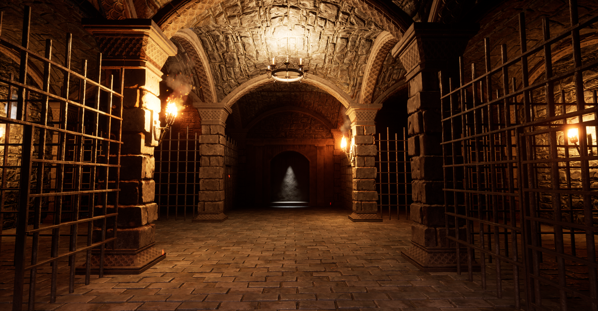
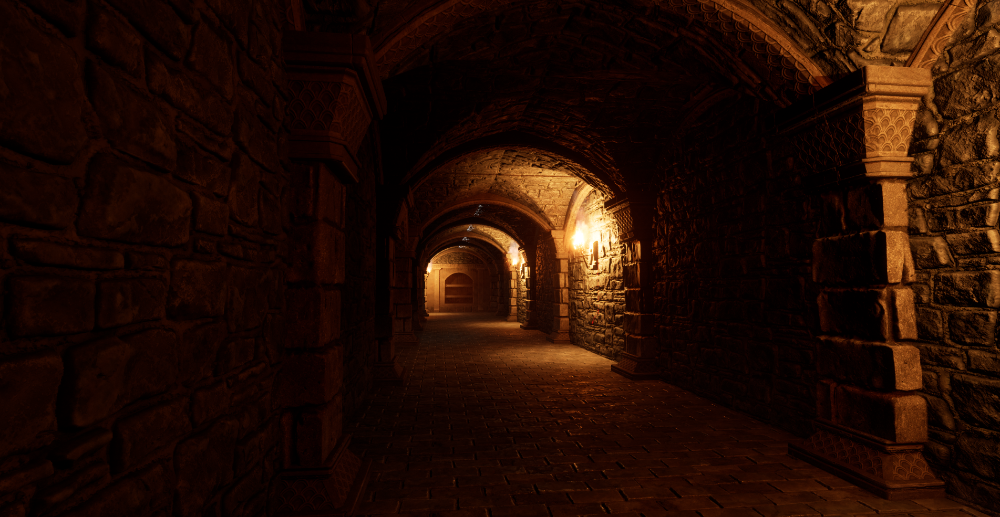
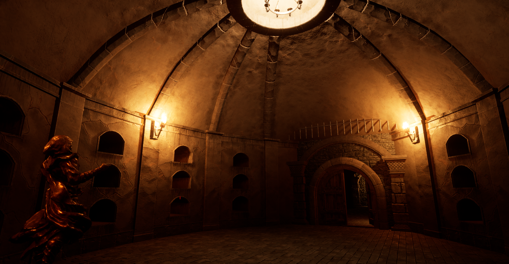

# The Dungeon
This repository contains a level designed in Unreal Engine 5 using a medieval dungeon asset pack.

Additionally, a simple gameplay experience has been programmed and included, combining C++ and Blueprint classes.

## Gameplay Scenario

In this mini-game, the player must find and steal a golden statue. To locate the statue, the player must explore three areas: the Dungeon, the Crypt, and the Mausoleum. Each area contains puzzles that must be solved to progress from one location to the next or to escape from traps along the way.

## Classes
Three main classes were utilized to create the gameplay: UGrabber, UMover, and UTriggerComponent.

### UGrabber Class
The Grabber class is responsible for grabbing and releasing grabbable objects.

```void UGrabber::GetGrabbableInReach(FHitResult& OutHitResult)```

This function checks if any grabbable object is within reach—defined by the range of the Pawn's location and MaxGrabDistance, and in front of the player. If so, it returns the HitResult of the grabbable object.

A grabbable object is defined as any object that is blocked by the Grabber collision channel (ECC_GameTraceChannel2). All other objects are set to ignore the Grabber collision channel.

```void UGrabber::Grab()```

This function grabs and moves objects to a specified holding position in front of the Pawn.

```void UGrabber::Release()```

This function releases previously grabbed objects.

### UMover Class
The Mover class is responsible for moving its owner object. Both speed and offset can be configured through the editor.

```void UMover::SetShouldMove(const bool NewValue)```

This function determines whether the mover should move the object or not, based on the provided boolean value.

```void UMover::TickComponent(float DeltaTime, ELevelTick TickType, FActorComponentTickFunction* ThisTickFunction)```

The actual movement of the object is handled within this function, which is called every frame to update the object's position according to the mover's settings.


### UTriggerComponent

The UTriggerComponent class is used to create a space that can trigger a mover when an object with a specific actor tag, "Unlock1," is placed within it.

```AActor* UTriggerComponent::GetAcceptableActor()```

This function checks the overlapping actors for the "Unlock1" tag. If an actor with this tag is found, the function returns that actor; otherwise, it returns nullptr.

```void UTriggerComponent::TickComponent(float DeltaTime, ELevelTick TickType, FActorComponentTickFunction* ThisTickFunction)```

This function is called every frame and checks if an overlapping object has the "Unlock1" tag. If it does, the function triggers the associated mover.

```void UTriggerComponent::SetMover(UMover* NewMover)```

This function is used within the blueprint of a moveable object to assign the mover responsible for moving the object to the TriggerComponent.

## Screenshots

The dungeon:



The Hallway and Crypt:



The Mausoleum and Golden statue:



## Unreal Engine version

This project is built using Unreal Engine 5.2.1.